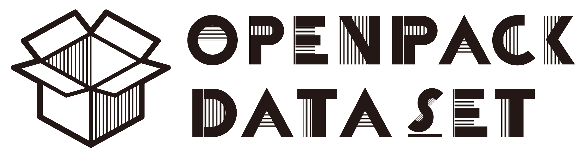

# OpenPack Dataset Toolkit (optk)



[](https://github.com/open-pack/openpack-toolkit/actions/workflows/test.yaml)
[](https://github.com/open-pack/openpack-toolkit/actions/workflows/deploy-docs.yaml)

["OpenPack Dataset"](https://open-pack.github.io) is a new large-scale multi modal dataset of manual packing process.
OpenPack is an open access logistics-dataset for human activity recognition, which contains human movement and package information from 16 distinct subjects.
This repository provide utilities to explore our exciting dataset.

## Docs

### Dataset

- [Subjects & Recording Scenarios](./docs/USER.md)
- [Activity Class Definition](./docs/ANNOTATION.md)
- [Modality](./docs/DATA_STREAM.md)
- [Data Split (Train/Val/Test/Submission)](./docs/DATA_SPLIT.md)

### Task & Activity Recognition Challenge

- Work Operation Recognition
  - [OpenPack Challenge 2022](./docs/OPENPACK_CHALLENGE/)

### Sample Data

[Sample](./samples/)

## Install

We provide some utility functions as python package. You can install via pip with the following command.

```bash
# Pip
pip install openpack-toolkit

# Poetry
poetry add  openpack-toolkit
```

## Examples

### Tutorial

- [Download and Visualization (Notebook)](./samples/OpenPack_DataVisualization.ipynb) [](https://colab.research.google.com/github/open-pack/openpack-toolkit/blob/main/samples/OpenPack_DataVisualization.ipynb)

### Work Activity Recognition (PyTorch)

PyTorch code samples for work operation prediction task is available.
See [openpack-torch](https://github.com/open-pack/openpack-torch) for more dietail.

## Download Dataset

```bash
optk-download -d ../data/datasets -v v0.3.0

# If you are a user of poetry,
poetry run optk-download -d ../data/datasets -v v0.3.0
```

Help:

```txt
$ poetry run optk-download -d ../data/datasets -h
usage: optk-download [-h] -d DATASET_DIR [-v VERSION] [-s STREAMS]

optional arguments:
  -h, --help            show this help message and exit
  -d DATASET_DIR, --dataset-dir DATASET_DIR
                        Path to dataset directory. Downloaded data will be stored under the directory
  -v VERSION, --version VERSION
                        Target dataset version. Default: v0.2.0
  -s STREAMS, --streams STREAMS
                        A list of data stream names that you want to download.
                        Stream names must be separated by commas. If none, all
                        data in zenodo will be downloaded. Defaul: none
```


## Links

- [Homepage](https://open-pack.github.io/) (External Site)
  - [OpenPack Challenge 2022](https://open-pack.github.io/challenge2022) (External Site)
- [zenodo](https://doi.org/10.5281/zenodo.5909086)
- [API Docs](https://open-pack.github.io/openpack-toolkit/openpack_toolkit/)
- [PyPI](https://pypi.org/project/openpack-toolkit/)
- [openpack-torch](https://github.com/open-pack/openpack-torch)


## License

openpack-toolkit has a MIT license, as found in the [LICENSE](./LICENCE) file.

NOTE: [OpenPack Dataset](https://doi.org/10.5281/zenodo.5909086) itself is available under [Creative Commons Attribution Non Commercial Share Alike 4.0 International](https://creativecommons.org/licenses/by-nc-sa/4.0/legalcode) license.
