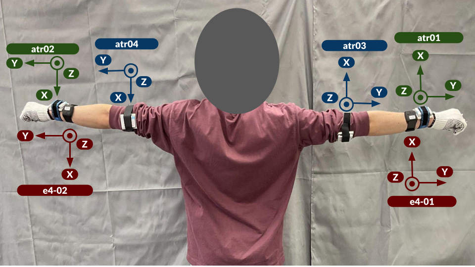

# Data Collection Environment & Sensors Coordinates

## Environments

With the help of industrial engineers, we constructed a 3m × 5m environment designed to simulate an actual workspace in a warehouse.
The following figure shows the sensor placement and default locations of equipment.

[PDF version](./assets/environment.pdf)

## Sensor Placement

### Wearables

The next figure shows the sensor placement in the data collection and sensor coordinate system.
The IMU was mounted so that the y-axis pointed to the fingertip and the z-axis was oriented vertically and inward toward the arm.

### Vision

The next figure shows the camera placements and their coordinate systems.

Reference:

- Azure Kinect DK: [Depth and color camera](https://learn.microsoft.com/th-th/azure/kinect-dk/coordinate-systems#depth-and-color-camera)
- Intel® RealSense™ Depth Camera D435i: [Projection in Intel RealSense SDK 2.0](https://dev.intelrealsense.com/docs/projection-in-intel-realsense-sdk-20)
