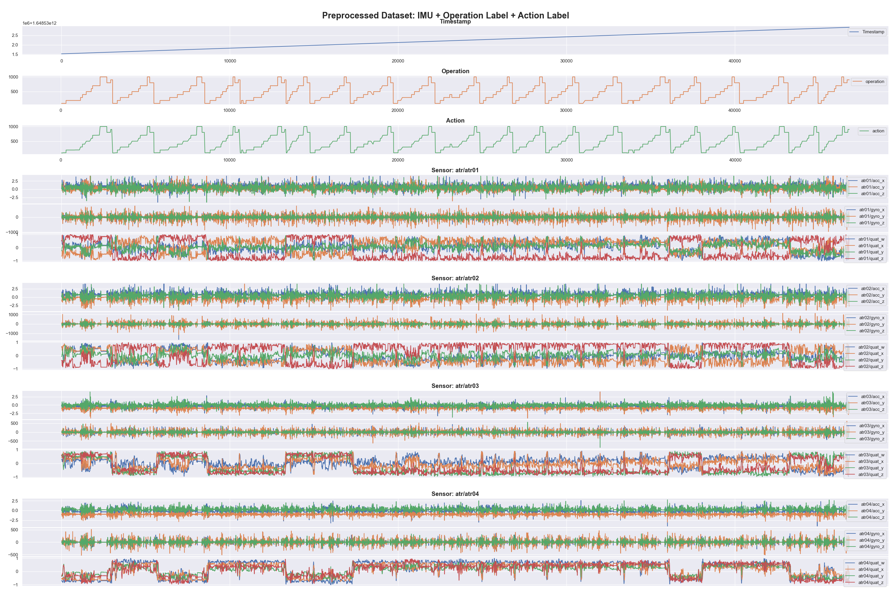

# Preprocessed Dataset - IMU (ATR)

## Build `imu-with-operation-action-label`

This preprocessed dataset contains data from 4 IMU sensors (`atr-qags`), work operation labels, and action labels in a single CSV. Here is a command to build this dataset with sample data.

```bash
poetry run python build_imu_with_labels.py \
        --atr-root-dir ../../openpack/v1.0.0/U0209/atr/ \
        --session S0500 \
        --operation-labels-path ../../openpack/v1.0.0/U0209/annotation/openpack-operations/S0500.csv \
        --action-labels-path ../../openpack/v1.0.0/U0209/annotation/openpack-actions/S0500.csv \
        --output-path ./build/imu/U0209-S0500.csv
```

or

```bash
make build-imu
```

You can visualize the generated CSV file with the following command.

```bash
poetry run python visalize.py -i PATH_TO_THE_GENERATED_CSV
```

Output Sample:


